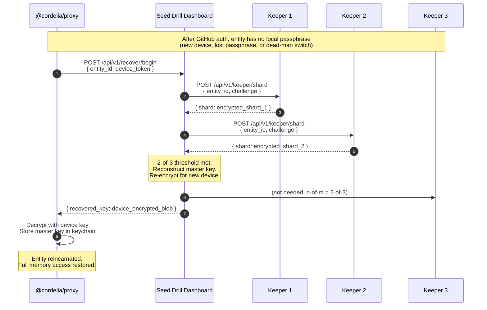

# Enrollment Sequence: New Claude Instance Provisioning

**Status**: Design draft
**Prerequisite**: User has an existing Cordelia account (signed up via dashboard)
**IDP**: GitHub OAuth 2.0
**Central service**: Seed Drill Dashboard (cordelia.seeddrill.ai)

---

## Overview

A registered user on a new machine wants to connect Claude Code to
their Cordelia memory. This is the device enrollment flow using
GitHub as the identity provider and the Seed Drill dashboard as the
enrolment service.

Two phases:
1. **Enrol** -- authenticate via GitHub, receive bearer token + node config
2. **Connect** -- proxy starts, syncs L1, Claude session begins with full memory

---

## Sequence Diagram

```mermaid
sequenceDiagram
    autonumber

    actor User
    participant CLI as Claude CLI
    participant Proxy as @cordelia/proxy<br/>(local, TypeScript)
    participant Browser
    participant Dashboard as Seed Drill Dashboard<br/>cordelia.seeddrill.ai
    participant GitHub as GitHub<br/>(OAuth IDP)
    participant Node as cordelia-node<br/>(Rust, Seed Drill infra)

    note over User,Node: Phase 1: Enrollment (one-time per device)

    User->>CLI: claude mcp add cordelia<br/>--transport stdio<br/>-- npx @cordelia/proxy

    note right of CLI: Registers MCP server<br/>in ~/.claude.json

    User->>Proxy: npx @cordelia/proxy enroll

    Proxy->>Proxy: Check ~/.cordelia/config.toml
    note right of Proxy: No config found.<br/>Begin enrollment.

    Proxy->>Dashboard: POST /api/v1/device/begin<br/>{ client_id: random }
    Dashboard-->>Proxy: { device_code: "ABCD-1234",<br/>verification_uri: "https://cordelia.seeddrill.ai/enroll",<br/>expires_in: 600,<br/>interval: 5 }

    Proxy->>Browser: Open verification_uri
    note right of Proxy: "Open browser and enter<br/>code: ABCD-1234"

    Browser->>Dashboard: GET /enroll
    Dashboard-->>Browser: Enrollment page<br/>(enter device code)

    User->>Browser: Enter device code ABCD-1234

    Browser->>Dashboard: POST /enroll/verify<br/>{ device_code: "ABCD-1234" }
    Dashboard-->>Browser: Redirect to GitHub OAuth

    Browser->>GitHub: GET /login/oauth/authorize<br/>?client_id=...&scope=read:user<br/>&state=...&redirect_uri=.../auth/github/callback

    User->>GitHub: Authenticate<br/>(username + password / SSO)

    GitHub-->>Dashboard: GET /auth/github/callback<br/>?code=AUTH_CODE&state=...

    Dashboard->>GitHub: POST /login/oauth/access_token<br/>{ client_id, client_secret, code }
    GitHub-->>Dashboard: { access_token: "gho_..." }

    Dashboard->>GitHub: GET /user<br/>Authorization: Bearer gho_...
    GitHub-->>Dashboard: { login: "russwing", id: 12345 }

    Dashboard->>Node: POST /api/v1/l1/read<br/>{ user_id: lookup by github_id }
    Node-->>Dashboard: { data: encrypted_l1_blob }

    note over Dashboard: Entity found.<br/>github_id matches.<br/>Generate bearer token.

    Dashboard->>Dashboard: Generate bearer token<br/>ck_<64-char hex><br/>Bind to entity + device

    Dashboard->>Node: Store device registration<br/>(entity_id, device_id, token_hash)

    Dashboard-->>Browser: "Device authorised.<br/>Return to terminal."

    note over Proxy,Dashboard: Meanwhile, proxy is polling...

    loop Poll every 5s until authorised or expired
        Proxy->>Dashboard: POST /api/v1/device/poll<br/>{ device_code: "ABCD-1234" }
        Dashboard-->>Proxy: { status: "pending" }
    end

    Proxy->>Dashboard: POST /api/v1/device/poll<br/>{ device_code: "ABCD-1234" }
    Dashboard-->>Proxy: { status: "complete",<br/>bearer_token: "ck_...",<br/>node_url: "https://cordelia.seeddrill.ai",<br/>entity_id: "russell_wing" }

    note right of Proxy: Prompt user for<br/>encryption passphrase

    User->>Proxy: Enter passphrase

    Proxy->>Proxy: Derive key via scrypt<br/>(N=16384, r=8, p=1)

    Proxy->>Proxy: Write ~/.cordelia/config.toml<br/>Write ~/.cordelia/node-token<br/>Store derived key in keychain

    note over User,Node: Phase 2: First Connection

    User->>CLI: Start new Claude session

    CLI->>Proxy: Start MCP server (stdio)

    Proxy->>Proxy: Load ~/.cordelia/config.toml<br/>Load bearer token

    Proxy->>Node: POST /api/v1/status<br/>Authorization: Bearer ck_...
    Node-->>Proxy: { node_id, entity_id,<br/>uptime_secs, peers, groups }

    note right of Proxy: Node reachable.<br/>Authenticated.

    Proxy->>Node: POST /api/v1/l1/read<br/>{ user_id: "russell_wing" }
    Node-->>Proxy: { data: encrypted_l1_blob }

    Proxy->>Proxy: Decrypt L1 with derived key<br/>Cache in L0 (session duration)

    Proxy-->>CLI: MCP tools ready<br/>(25 tools registered)

    CLI-->>User: Session start hook fires<br/>L1 hot context loaded<br/>"Session 40 | Genesis +5d"

    note over User,Node: Entity is sovereign.<br/>Full memory restored.<br/>Encryption key never<br/>leaves local machine.

    note over User,Node: Phase 3: Subsequent Sessions (automatic)

    User->>CLI: Start Claude session (any time)
    CLI->>Proxy: Start MCP server (stdio)
    Proxy->>Proxy: Load config + token
    Proxy->>Node: POST /api/v1/l1/read<br/>Bearer ck_...
    Node-->>Proxy: { data: encrypted_l1_blob }
    Proxy->>Proxy: Decrypt, cache in L0
    Proxy-->>CLI: MCP ready
    CLI-->>User: Full memory, zero friction
```



---

## Actors

| Actor | Role | Trust boundary |
|-------|------|----------------|
| **User** | Human entity, sovereign | Trusted (is the entity) |
| **Claude CLI** | LLM host, MCP client | Trusted by extension (local machine) |
| **@cordelia/proxy** | Local TypeScript process | Trusted by extension (holds encryption key) |
| **Browser** | OAuth user agent | Trusted by necessity (user authenticates) |
| **Seed Drill Dashboard** | Enrollment service + web UI | Trusted for identity verification only. Never sees plaintext memory. |
| **GitHub** | OAuth identity provider | Trusted for authentication only. read:user scope. |
| **cordelia-node** | Rust node on Seed Drill infra | Stores encrypted blobs only. Never sees plaintext. |

---

## New API Endpoints Required (Dashboard)

These endpoints are needed for the device authorization flow:

| Method | Path | Purpose |
|--------|------|---------|
| POST | `/api/v1/device/begin` | Start device enrollment, return device_code |
| POST | `/api/v1/device/poll` | Poll for enrollment completion |
| POST | `/enroll/verify` | Verify device code (browser-side) |
| GET | `/enroll` | Enrollment page (enter device code) |

This follows the [OAuth 2.0 Device Authorization Grant](https://www.rfc-editor.org/rfc/rfc8628)
(RFC 8628), the same pattern used by GitHub CLI (`gh auth login`),
Azure CLI, and Google Cloud CLI.

---

## Security Properties

1. **Passphrase never transmitted.** The encryption key is derived
   locally via scrypt. The dashboard and node never see it.

2. **Bearer token is device-scoped.** Each device gets its own token.
   Revoking one device doesn't affect others.

3. **GitHub scope is minimal.** `read:user` only -- no repo access,
   no org access, no write permissions.

4. **Device code is short-lived.** Expires in 10 minutes (configurable).
   One-time use. Cannot be replayed.

5. **Polling is rate-limited.** 5-second minimum interval. Dashboard
   returns 429 on faster polling.

6. **No long-lived browser session required.** Once the device is
   authorised, the browser can be closed. The proxy has the bearer
   token.

7. **Encryption key storage.** On macOS: Keychain. On Linux:
   `libsecret` / `gnome-keyring`. Fallback: `~/.cordelia/keyfile`
   with 0600 permissions (warn user).

---

## R4 Extension: Keeper-Assisted Key Recovery

When an entity has Shamir shards stored with Secret Keepers, the
enrollment flow extends:



The keepers hold shards but **cannot read them** (each shard is
encrypted to the entity's public key). The dashboard orchestrates
shard retrieval but **cannot reconstruct the key** -- only the
entity's authenticated device can decrypt the shards and reconstruct.

True n-of-m: any 2 of 3 keepers suffice. Losing one keeper is
not a catastrophe.

---

## CLI Commands Summary

```bash
# One-time: register MCP server with Claude
claude mcp add cordelia --transport stdio -- npx @cordelia/proxy

# One-time: enroll this device
npx @cordelia/proxy enroll

# Ongoing: just use Claude normally
claude
# -> session starts with full memory, zero friction
```

---

## Implementation Priority

| Component | Release | Owner |
|-----------|---------|-------|
| Device authorization endpoints | R3 | Martin (WP1) |
| Enrollment page (dashboard) | R3 | Martin |
| Proxy `enroll` CLI command | R3 | Martin |
| Keychain storage (macOS/Linux) | R3 | Martin |
| Bearer token generation + scoping | R3 | Russell (API) |
| Keeper shard protocol (0x06) | R4 | Russell (wire) + Martin (ops) |
| Key recovery flow | R4 | Both |

---

*Last updated: 2026-01-31*
*Russell Wing, Martin Stevens, and Claude (Opus 4.5)*
